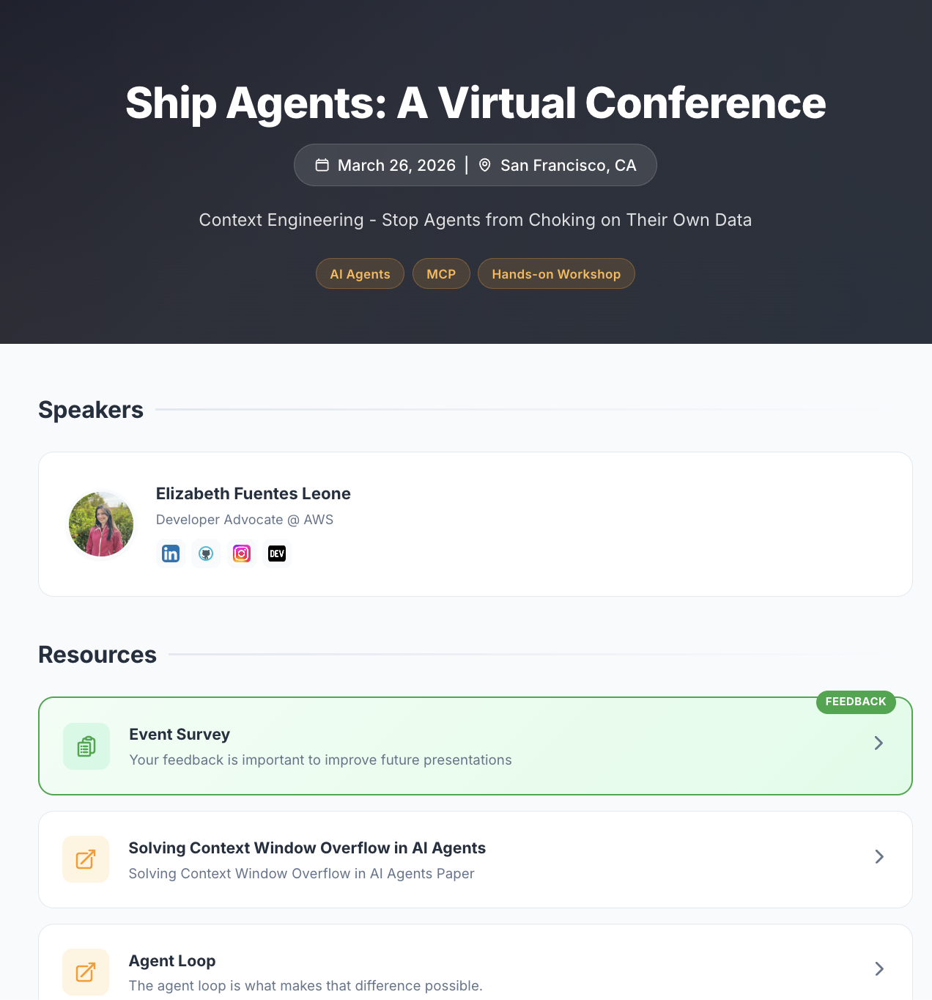

# Event Resources Website

Share presentation decks, repos, and resources with your audience after talks and workshops. Edit a single JSON file, deploy, and share the link.

## Projects

| Project | Description | Stack |
|---------|-------------|-------|
| [web-site](./web-site/) | S3 + CloudFront deployment with AWS CDK |    |
| [amplify-site](./amplify-site/) | Auto-deploy on push with AWS Amplify Hosting |    |
| [vercel-site](./vercel-site/) | One-click deploy with Vercel |    |
| [qr-generator](./qr-generator/) | Jupyter notebook to generate QR codes for sharing the website URL |   |



## Which One Should I Use?

| Option | Best for | AWS Account needed? | Difficulty |
|--------|----------|---------------------|------------|
| **Amplify** | Push-to-deploy simplicity with AWS | Yes | Low |
| **S3 + CDK** | Full infrastructure-as-code control | Yes | Medium |
| **Vercel** | Fastest setup, no AWS needed | No | Low |

## How It Works

All three versions share the same concept:

1. **Edit** `event_config.json` with your event name, speakers, and resources
2. **Deploy** using the platform of your choice
3. **Share** the URL with your audience

The page reads the JSON file at load time and renders the event dynamically. No backend, no database.

## Quick Start

Pick one version and follow its README:

- [S3 + CDK Setup Guide](./web-site/README.md)
- [Amplify Setup Guide](./amplify-site/README.md)
- [Vercel Setup Guide](./vercel-site/README.md)

## Customizing Your Event

All versions use the same `event_config.json` format:

```json
{
  "event": {
    "name": "Your Event Name",
    "date": "March 25, 2026",
    "location": "City, Country",
    "description": "What the event is about",
    "tags": ["Topic 1", "Topic 2"]
  },
  "speakers": [ ... ],
  "resources": [ ... ]
}
```

### Resource Types

Each resource card shows a different icon based on its `type` field:

| Type | Icon | Use for |
|------|------|---------|
| `link` | External link | General URLs |
| `github` | GitHub logo | Repositories |
| `article` | Book | Blog posts, docs |
| `pdf` | Document | Presentation decks |
| `survey` | Clipboard | Feedback forms (highlighted in green) |

### Adding Speakers

Add objects to the `speakers` array with `name`, `title`, `image` (local path in `img/`), and `social_links`. The grid adapts automatically.

### Adding Resources

Add objects to the `resources` array with `title`, `description`, `url`, `type`, and `highlight` (boolean).

## Cost

The S3 + CDK and Amplify versions run at zero cost under [AWS Free Tier](https://aws.amazon.com/free/):

- **Amazon S3**: 5 GB storage, 20,000 GET requests/month
- **Amazon CloudFront**: 1 TB data transfer, 10M requests/month
- **AWS Amplify**: 5 GB storage, 15 GB served/month

The Vercel version is free under the [Vercel Hobby plan](https://vercel.com/pricing).

---

## Contributing

Contributions are welcome! See [CONTRIBUTING](CONTRIBUTING.md) for more information.

---

## Security

If you discover a potential security issue in this project, notify AWS/Amazon Security via the [vulnerability reporting page](http://aws.amazon.com/security/vulnerability-reporting/). Please do **not** create a public GitHub issue.

---

## License

This library is licensed under the MIT-0 License. See the [LICENSE](LICENSE) file for details.

---

🇻🇪🇨🇱 [Dev.to](https://dev.to/elizabethfuentes12) [Linkedin](https://www.linkedin.com/in/lizfue/) [GitHub](https://github.com/elizabethfuentes12/) [Twitter](https://twitter.com/elizabethfue12) [Instagram](https://www.instagram.com/elifue.tech) [Youtube](https://www.youtube.com/channel/UCr0Gnc-t30m4xyrvsQpNp2Q)
[Linktr](https://linktr.ee/elizabethfuentesleone)
