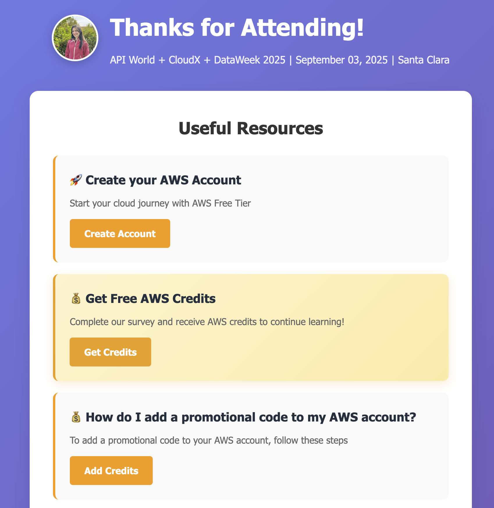

# Event Resources Website

Build a customizable static website on [Amazon S3](https://aws.amazon.com/s3/) and [Amazon CloudFront](https://aws.amazon.com/cloudfront/) to share event resources with attendees. Perfect for speakers who want to share account creation links, surveys, demo repositories, and social media links after presentations.

## 📱 Applications

| Application | Description | Location |
|-------------|-------------|----------|
| **Event Resources Website** | Static website with event resources, social links, and AWS credits section. Deployed using CDK on Amazon S3 + CloudFront | `web-site/` |
| **QR Code Generator** | Jupyter notebook to generate QR codes for sharing the website URL with event attendees | `qr-generator/` |




## 🚀 Features

- **Static Website**: Fast, secure, and cost-effective
- **JSON Configuration**: Configure each event through a single JSON file
- **Customizable Content**: Add any resource cards to the website
- **Professional Design**: Responsive design with clean branding
- **CDK Deployment**: Infrastructure as Code with AWS CDK
- **Private Repository**: Deploy without making your repo public
- **Social Media Integration**: LinkedIn, Twitter, GitHub, YouTube, Instagram
- **Credits Section**: Highlighted section for free credits or special offers
- **PDF Resources**: Include presentation decks and other downloadable materials

## 🛠️ Built with AWS CDK

This application uses [AWS Cloud Development Kit (CDK)](https://docs.aws.amazon.com/cdk/) - a software development framework for defining cloud infrastructure in code. CDK provides:
- Infrastructure definition using familiar programming languages
- Programming constructs such as loops, conditions, and functions
- IDE features such as auto-complete and inline documentation
- Software engineering practices applied to infrastructure

## 📁 Project Structure

```
web-site/
├── website/                 # Static website files
│   ├── index.html          # Main HTML template
│   └── styles.css          # CSS styles
├── web_site/               # CDK stack
│   └── web_site_stack.py   # S3 + CloudFront infrastructure
├── customize_event.py      # Event customization script
├── event_config.json       # Event configuration
├── app.py                  # CDK app entry point
└── requirements.txt        # Python dependencies
```

## 🛠️ Setup

1. **Install dependencies:**
```bash
pip install -r requirements.txt
```

2. **Configure AWS credentials:**
```bash
aws configure
```

3. **Bootstrap CDK (first-time setup only):**
```bash
cdk bootstrap
```

## 📝 Customization

### Event Configuration
Edit `web-site/event_config.json` with your event details:
```json
{
  "event_name": "Your Event Name",
  "date": "Event Date",
  "city": "Event City",
  "credits_url": "https://forms.gle/your-credits-survey",
  "survey_url": "https://forms.gle/your-feedback-survey",
  "demo_url": "https://github.com/your-username/your-demo",
  "deck_pdf": "your-presentation.pdf",
  "linkedin_profile_image": "https://your-profile-image-url",
  "social_links": {
    "linkedin": "https://linkedin.com/in/your-profile",
    "twitter": "https://twitter.com/your-username",
    "github": "https://github.com/your-username",
    "youtube": "https://youtube.com/@your-channel",
    "instagram": "https://instagram.com/your-username"
  }
}
```

### Customizable Website Content
The `web-site/website/index.html` file contains resource cards that you can modify:

- **AWS Account Creation**: Direct link to AWS Free Tier
- **AWS Credits**: Highlighted section for survey-based credits
- **Presentation Deck**: PDF download of your slides
- **Event Survey**: Feedback collection form
- **Project Demo**: Link to your demo repository
- **Custom Resources**: Add any additional resource cards

**Important**: When adding new resource cards, add the corresponding URLs to `event_config.json` so the customization script can update them automatically.

### Apply Customization
After editing the configuration:
```bash
cd web-site
python3 customize_event.py
```

## 🚀 Deployment

1. **Deploy the stack:**
```bash
cdk deploy
```

2. **Get your website URL:**
The CloudFront URL appears in the output after deployment.

## 🔄 Updating for New Events

1. Update `event_config.json` with new event details
2. Run `python3 customize_event.py`
3. Deploy changes: `cdk deploy`

## 🔧 CDK Commands

- `cdk ls` - List all stacks
- `cdk synth` - Synthesize CloudFormation template
- `cdk deploy` - Deploy the stack
- `cdk diff` - Compare deployed stack with current state
- `cdk destroy` - Remove the stack

## 💰 AWS Free Tier & Costs

This application runs at zero cost under AWS Free Tier:

- **Amazon S3**: 5 GB of storage, 20,000 GET requests, 2,000 PUT requests per month
- **Amazon CloudFront**: 1 TB of data transfer out, 10,000,000 HTTP/HTTPS requests per month

For a typical event resources website (few MB of static files), you stay within free tier limits.

**After Free Tier or for higher usage:**
- Amazon S3: ~$0.023 per GB stored per month
- Amazon CloudFront: ~$0.085 per GB transferred

For detailed pricing information:
- [Amazon S3 Pricing](https://aws.amazon.com/s3/pricing/)
- [Amazon CloudFront Pricing](https://aws.amazon.com/cloudfront/pricing/)
- [AWS Pricing Calculator](https://calculator.aws)

## 💡 Benefits

- **Private Repository**: Your code stays private
- **Fast Loading**: CloudFront CDN provides global performance
- **Cost Effective**: Zero cost with Free Tier, minimal cost otherwise
- **Professional Design**: Clean, responsive layout
- **Quick Updates**: JSON configuration for rapid changes
- **Secure**: HTTPS by default with CloudFront

## 🔒 Security

- Repository remains private
- HTTPS enforced via CloudFront
- S3 bucket configured with appropriate public access settings
- No sensitive data in the website code

---

Gracias! 

🇻🇪🇨🇱 [Dev.to](https://dev.to/elizabethfuentes12) [Linkedin](https://www.linkedin.com/in/lizfue/) [GitHub](https://github.com/elizabethfuentes12/) [Twitter](https://twitter.com/elizabethfue12) [Instagram](https://www.instagram.com/elifue.tech) [Youtube](https://www.youtube.com/channel/UCr0Gnc-t30m4xyrvsQpNp2Q)
[Linktr](https://linktr.ee/elizabethfuentesleone)